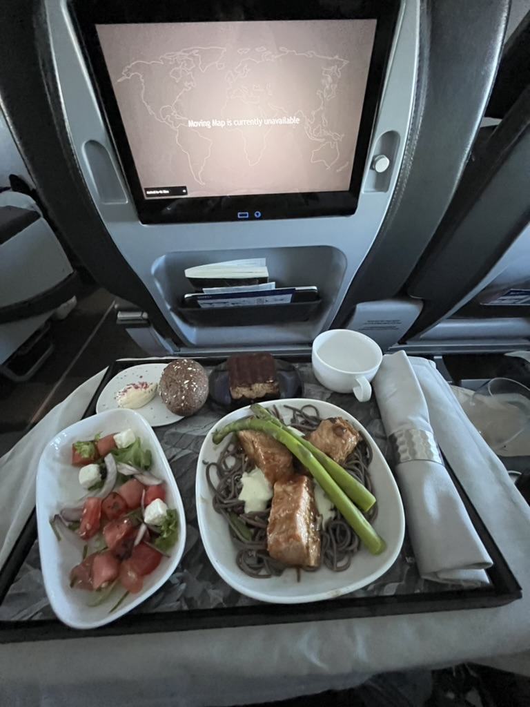
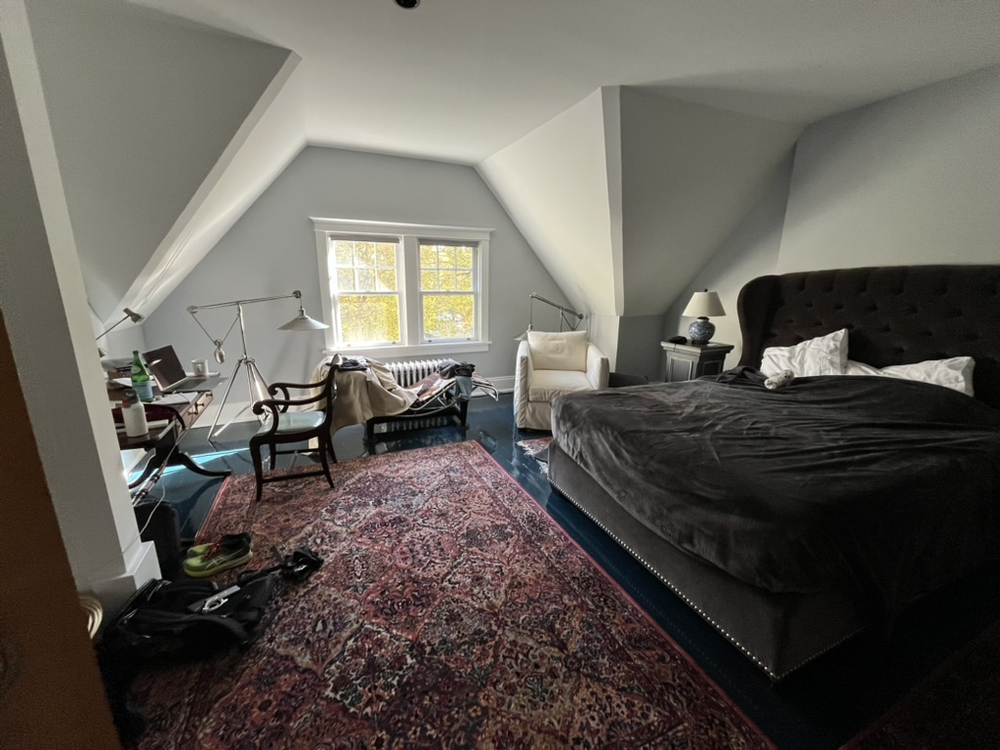
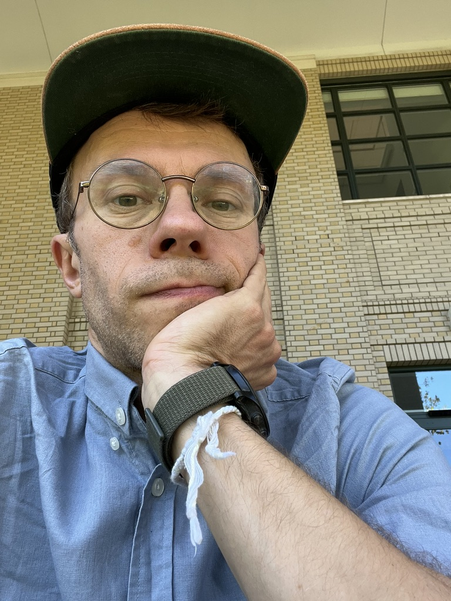
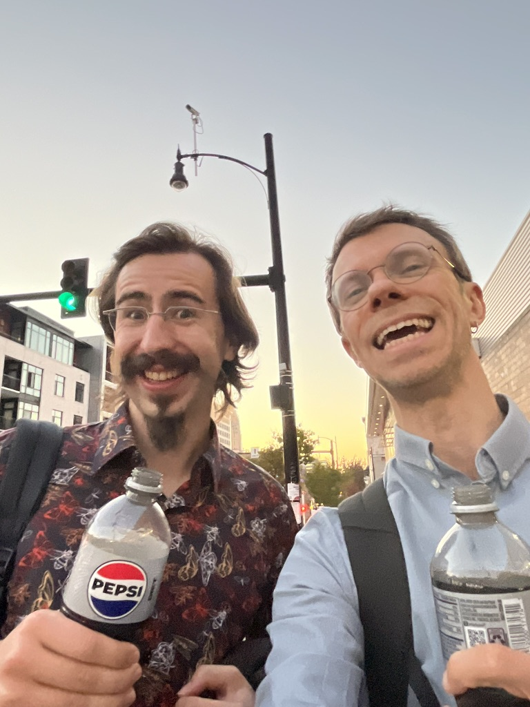
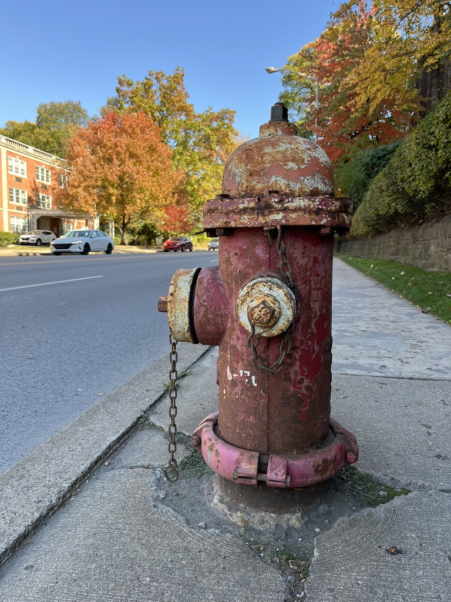
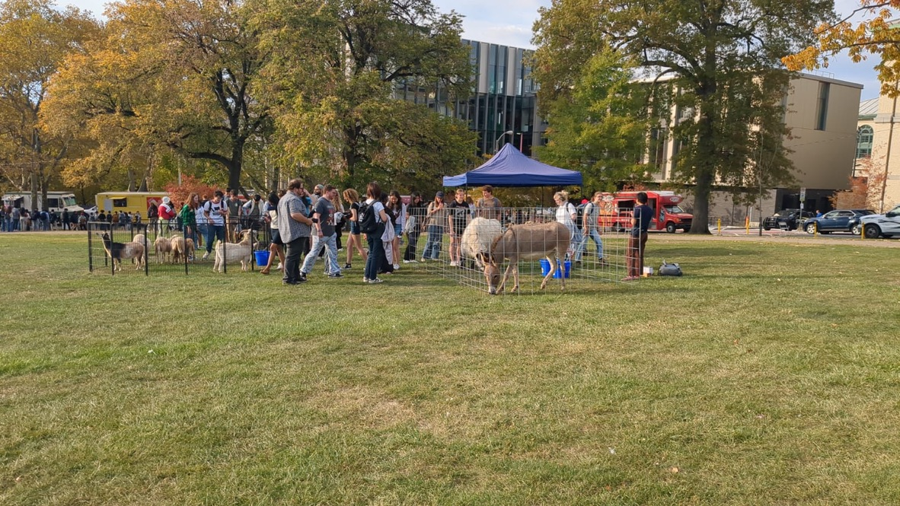

---
# You don't need to edit this file, it's empty on purpose.
# Edit theme's home layout instead if you wanna make some changes
# See: https://jekyllrb.com/docs/themes/#overriding-theme-defaults
layout: page
---
## Kirjeitä Atlantin takaa

Business class! Kyllä. Oikeat metalliset ruokailuvälineet ja nuudelilohi. Silti ehkä tärkeämpää on se että tuossa on vain kaksi penkkiä rinnakkain tilassa johon economy-luokassa laitetaan kolme. Aika paljon mukavampi istua ja nukkua.

Makuuhuoneessa on hieno divaani. 

Euroopassa ajetaan autoa jos on pakko. Jos paikkaan ei pääse julkisilla. Jenkeissä taas mennään bussilla vain jos autoa ei ole. Istun bussissa ja katson muita matkustajia. Jokaisella on hyvä syy olla bussissa. Yhdellä on päällä hampurilaispaikan työvaatteet, yksi on mielenterveyspotilas tai toivottavasti kuntoutuja. Yhdestä naisesta en tiedä, siitä en päältä huomaa mitään erityistä syytä sille miksei se aja omaa autoa. Vasta kun se nousee pysäkin lähestyessä seisomaan mä tajuan. Sillä on valkoinen keppi, se on sokea. 

Tämä on ihan kuin jostain vanhasta cola-mainoksesta, höyrähtäneet kaverit. Max on ihan huippu, se koodaa ja intoilee monista samoista asioista kuin minäkin. 

Sitten tällainen ajatus: Amerikassa kaikki on aina täysillä. Vertaus: jos Euroopassa stereoiden volyyminappi käännetään puoleen väliin, täällä ne laitetaan kympille. Kaikki on äärimmäistä, hyvä ja paha. Ystävällisyys mutta myös epätasa-arvo. Tykkään siitä silti, täällä on ihan sikana energiaa. Amerikkalaiseen unelmaan kuuluu ajatus siitä että kaikki on mahdollista, ja täällä uskotaan siihen.

Esimerkki. Euroopassa tekoälyä säännellään rankasti kun ajatellaan että se voi johtaa huonoihin tilanteisiin. Täällä ei säännellä koska ajatellaan että siitä voi tulla vaikka mitä uutta ja jännittävää.

Tässä on vesiposti.

Ei liity vesipostiin vaan tuohon mitä kirjoitin edellä: amerikkalaiset on romantikkoja, ne on ihan fiiliksissä niiden isosta avarasta maasta ja sen upeasta luonnosta. Ne ihailee niiden vuoria ja hiekkarantoja ehkä vielä enemmän kuin me ulkopuoliset.  En ollut tajunnut tätä aiemmin, mutta amerikkalaisille on tärkeää että ne on uudisraivaajien jälkeläisiä, ja siksi uudisraivaajia itsekin. Jokainen täällä tietää mistä Euroopan maasta (tai muualta) niiden suku on tullut. Mutta ne ei tiedä sitä siksi että voisivat samaistua taustaansa. Ne haluaa tietää sen siksi, että tietävät minkä jättivät taakseen! Ne ei ole vanhaa maailmaa vaan uutta, tulevaisuuden tuuli!

Yhdessä aitauksessa on vuohia. Toisessa on aasi. Vuohet kuuluu sellaiselle firmalle joka vuokraa niitä ruohonleikkuriksi. Esim. yliopisto vuokraa vuohet leikkaamaan ruohot sellaisilta jyrkiltä rinteiltä joilla on vaikea käyttää ruohonleikkuria. Aasi taas tarvitaan siksi että vuohet stressaantuvat helposti esim. autojen metelistä. Aasi on niiden terapia-aasi, se rauhoittaa vuohia.